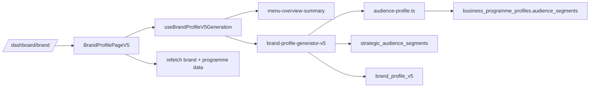

# Segment Generation Overview

This document maps where audience segments are generated, how the data moves through the dashboard flow, and which database fields store the result.

## End-to-End Flow

1. The dashboard route mounts [BrandProfilePageV5](src/pages/dashboard/BrandProfilePageV5.tsx).
2. The page resolves the active `businessId` from `businesses` and loads existing brand/programme data.
3. The regeneration hook first calls `menu-overview-summary` and then calls `brand-profile-generator-v5`.
4. The V5 edge function reads business context, menu data, location data, operations, opening hours, and programme rows.
5. For each programme, the audience layer generates `audience_segments`.
6. Those programme rows are saved into `business_programme_profiles`.
7. The edge function flattens the programme-level segments into `business_brand_profile.strategic_audience_segments`.
8. The full V5 JSON payload is stored in `business_brand_profile.brand_profile_v5`.
9. The dashboard refetches both the brand profile and programme profiles after regeneration.



## Where The Page Is Wired

```ts
// src/App.tsx
const BrandProfilePage = lazy(() =>
  import('./pages/dashboard/BrandProfilePageV5').then((module) => ({ default: module.default }))
)

<Route path="brand" element={<BrandProfilePage />} />
```

```ts
// src/pages/dashboard/BrandProfilePageV5.tsx
const { profile, loading, error, updatedAt: _updatedAt, refetch } = useBrandProfile(businessId);
const { programmes, loading: programmesLoading, refetch: refetchProgrammes } = useProgrammeProfiles(businessId);
const { generatingV5, generate: generateV5 } = useBrandProfileV5Generation();

const handleRegenerateV5 = async () => {
  if (!businessId) return;
  const result = await generateV5(businessId, true);
  if (result) {
    await Promise.all([
      refetch(),
      refetchProgrammes(true)
    ]);
  }
};
```

## Generation Hook

```ts
// src/hooks/useBrandProfileV5Generation.ts
// 1. Calls menu-overview-summary Edge Function (generates cross-menu summary)
// 2. Calls brand-profile-generator-v5 Edge Function (uses pre-generated summary)

const { data: menuSummaryData, error: menuSummaryError } = await supabase.functions.invoke(
  'menu-overview-summary',
  { body: { businessId } }
);

const { data, error: invokeError } = await supabase.functions.invoke(
  'brand-profile-generator-v5',
  {
    body: {
      businessId,
      forceRegenerate,
      menuOverviewSummary: menuSummaryData?.menu_overview_summary || null,
    },
  }
);
```

## Where Segments Are Generated

The segment generation logic lives in [audience-profile.ts](supabase/functions/_shared/brand-profile/audience-profile.ts).

```ts
// supabase/functions/_shared/brand-profile/audience-profile.ts
export interface AudienceSegment {
  people_type: string;
  segment_size: string;
  motivation: string;
  decision_timing: string;
  content_angles: string[];
  location_occasions: string[];
  concept_fit_reason: string;
  evidence: string[];
}

export async function generateAudienceSegments(...) : Promise<ProgrammeAudienceProfile> {
  const targetSegmentCount = determineSegmentCount(programme, menu, location, breadthResult.tier);
  const response = await client.chat.completions.create({
    model: "gpt-4o-mini",
    messages: [
      { role: "system", content: getV5Prompt('audience', language) },
      { role: "user", content: userPrompt }
    ],
    temperature: 0.3,
    max_tokens: 1500,
    response_format: { type: "json_object" }
  });
}
```

Validation in the same file ensures the AI output has the expected shape:

```ts
function validateAudienceProfile(...) {
  if (profile.audience_segments.length < 2 || profile.audience_segments.length > 4) {
    errors.push(`Segment count must be 2-4, got ${profile.audience_segments.length}`);
  }

  if (!profile.audience_segments.find(s => s.segment_size === "primary")) {
    errors.push("No primary segment found");
  }
}
```

## Edge Function Save Path

The V5 generator reads the input tables, builds programme rows, and persists the results.

```ts
// supabase/functions/brand-profile-generator-v5/index.ts
const { data: brandProfile } = await supabaseClient
  .from('business_brand_profile')
  .select('content_strategy')
  .eq('business_id', businessId)
  .maybeSingle();

const { data: programmes } = await supabaseClient
  .from('business_programme_profiles')
  .select('programme_type, programme_name, time_windows, baseline_goal_split, decision_timing, audience_segments')
  .eq('business_id', businessId);
```

Programme rows are saved with the segment payload:

```ts
// supabase/functions/brand-profile-generator-v5/index.ts
const programmeProfilesToSave = dedupedProgrammesEnriched.map(({ programme, commercialOrientation, audienceProfile }) => ({
  business_id: businessId,
  programme_type: programme.type,
  programme_name: programme.label,
  time_windows: [`${programme.timeWindow.start}-${programme.timeWindow.end}`],
  operating_days: programme.daysOfWeek,
  baseline_goal_split: commercialOrientation.baseline_goal_split,
  decision_timing: commercialOrientation.decision_timing,
  audience_segments: audienceProfile.audience_segments,
  segment_confidence: audienceProfile.segment_confidence,
  segment_reasoning: audienceProfile.segment_reasoning,
}))
```

Then the brand-level flattened fields are saved:

```ts
// supabase/functions/brand-profile-generator-v5/index.ts
await supabaseClient
  .from('business_brand_profile')
  .upsert({
    business_id: businessId,
    brand_profile_v5: v5Profile,
    business_identity_persona: businessIdentityPersona.system_persona || null,
    marketing_manager_brief: marketingManagerBrief.marketing_manager_brief || null,
    commercial_baseline_mode: commercialMode,
    strategic_audience_segments: strategicSegments,
    strategic_coverage: strategicCoverage,
    content_strategy: legacyContentStrategy || null,
  })
```

The strategic segment flattener keeps only the primary and secondary summary:

```ts
// supabase/functions/brand-profile-generator-v5/index.ts
function extractStrategicSegments(segments: Array<{ label: string; segment_size?: 'primary' | 'secondary' | 'niche'; ... }>): any {
  const primary = segments.find(seg => seg.segment_size === 'primary');
  const secondary = segments.filter(seg => seg.segment_size === 'secondary');

  return {
    primary: primary ? { id: ..., name: primary.people_type, timing: null } : null,
    secondary: secondary.length > 0 ? secondary.map(seg => ({ id: ..., name: seg.people_type, timing: null })) : null
  };
}
```

## Database Fields

### `business_programme_profiles`

Defined in [supabase/migrations/20260506_create_business_programme_profiles.sql](supabase/migrations/20260506_create_business_programme_profiles.sql).

Relevant fields:

- `business_id`
- `programme_type`
- `programme_name`
- `time_windows`
- `operating_days`
- `menu_evidence`
- `confidence`
- `baseline_goal_split`
- `decision_timing`
- `content_type_affinity`
- `audience_segments`
- `segment_confidence`
- `segment_reasoning`

### `business_brand_profile`

Relevant fields used by the flow:

- `brand_profile_v5`
- `brand_profile_v5_generated_at`
- `brand_profile_v5_version`
- `business_identity_persona`
- `strategic_audience_segments`
- `content_strategy`
- `commercial_baseline_mode`
- `strategic_coverage`
- `location_strategy`
- `marketing_manager_brief`
- `business_character`
- `voice_guardrails`

## What Each Segment Field Means

The `audience_segments` array in `business_programme_profiles` contains programme-specific segment objects with:

- `people_type`
- `segment_size`
- `motivation`
- `decision_timing`
- `content_angles`
- `location_occasions`
- `concept_fit_reason`
- `evidence`

The flattened `strategic_audience_segments` field is not the full segment payload. It is a compact summary used by downstream consumers that only need the primary and secondary audience names and timing summary.

## Practical Read

- `business_programme_profiles.audience_segments` is the source of truth for programme-level audience generation.
- `business_brand_profile.strategic_audience_segments` is the runtime-friendly summary.
- `business_brand_profile.brand_profile_v5` is the full V5 JSONB document.
- The dashboard page only triggers generation and refetches; it does not generate segments itself.
