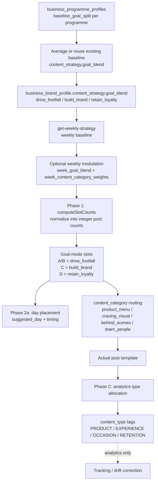

# Weekly Strategy Flow Overview

This document summarizes how the weekly strategy system turns programme-level data into post allocations.

## Main Flow

## What Leads To What

1. `business_programme_profiles.baseline_goal_split` is the source input for each programme.
2. `content_strategy.goal_blend` is the business-wide baseline, reused if already present or derived from programme splits when needed.
3. `get-weekly-strategy` reads that baseline and may apply weekly modulation when context signals justify it.
4. `Phase 1` converts the normalized goal blend into concrete post counts and goal-mode slots.
5. `Phase 2a` uses those slots to place posts on days and decide the template-oriented `content_category`.
6. `Phase C` assigns `content_type` labels **after post creation** for analytics and drift correction, not for template routing.

## Terminology: Split vs Blend

These field names differ intentionally to reflect different stages of data flow:

- **`baseline_goal_split`** (programme level): Raw strategic input per programme in `business_programme_profiles`. Each programme defines its own split across the three goals.
- **`goal_blend`** (business level): Normalized business-wide baseline in `business_brand_profile.content_strategy`. Derived by averaging active programme splits or reused if already present.
- **`week_goal_blend`** (weekly override): Context-modulated weekly strategy returned by `get-weekly-strategy`. Replaces the baseline when context signals (weather, events, etc.) justify adjustment.

**Important**: These are not synonyms. Renaming them would collapse semantic distinctions and break field lookups across the weekly strategy stack.

## Split Logic

- Goal split: `drive_footfall`, `build_brand`, `retain_loyalty`
- Template routing: `product_menu`, `craving_visual`, `behind_scenes`, `team_people`
- Analytics type system: `PRODUCT`, `EXPERIENCE`, `OCCASION`, `RETENTION`

The important distinction is that the goal split decides how many posts should support each strategic objective, while the content type system labels the posts after the fact.

## Goal Mode Slot Notation

Goal-mode slots use A/B/C/D notation:

- **A/B slots** = `drive_footfall` (combined category representing immediate conversion-oriented posts)
  - A and B are not distinct slot types; the slash indicates these are unified under the drive_footfall goal
  - Both route to conversion-focused content categories
- **C slots** = `build_brand` (awareness and identity-building posts)
- **D slots** = `retain_loyalty` (relationship and retention-focused posts)

This notation originates from legacy template routing but is preserved for consistency with existing Phase 1 slot allocation logic.

## Mapping Tables

### Goal Mode → Content Category (Template Routing)

| Goal Mode | Primary Categories | Rationale |
|-----------|-------------------|-----------|
| A/B (drive_footfall) | `product_menu`, `craving_visual` | Direct product showcases and appetite triggers drive immediate visits |
| C (build_brand) | `behind_scenes`, `team_people` | Story and identity content build emotional connection and brand recognition |
| D (retain_loyalty) | Balanced mix across all categories | Retention requires variety to maintain engagement across customer segments |

**Note**: Content category weights can be further modulated via `week_content_category_weights` when weekly context requires adjustment.

### Content Category → Content Type (Analytics)

| Content Category | Analytics Type | Applied After |
|-----------------|----------------|---------------|
| `product_menu` | `PRODUCT` | Post creation |
| `craving_visual` | `PRODUCT` or `OCCASION` | Post creation (occasion-driven cravings → OCCASION) |
| `behind_scenes` | `EXPERIENCE` | Post creation |
| `team_people` | `EXPERIENCE` | Post creation |

**Special cases**:
- Retention-focused posts may override to `RETENTION` type regardless of category
- Occasion-triggered content (holidays, events) may override to `OCCASION` type
- Analytics type assignment happens in Phase C **after** template selection and post creation

## Modulation Interaction Rules

When weekly context requires strategy adjustment, modulation can occur at two levels:

1. **Strategic modulation** (`week_goal_blend`): Replaces the baseline goal split to shift overall strategic focus (e.g., increase drive_footfall during slow periods)
2. **Template modulation** (`week_content_category_weights`): Adjusts the mix of content categories within existing goal allocations (e.g., emphasize `behind_scenes` during local events)

**Interaction precedence**:
- If `week_goal_blend` is present, it replaces `goal_blend` for slot allocation in Phase 1
- If `week_content_category_weights` is present, it biases content category routing in Phase 2a
- Both can be applied simultaneously: strategic override sets post counts, template weights refine category distribution
- Neither affects analytics type assignment in Phase C (that follows deterministic category→type rules)

## Notes

- If `content_strategy.goal_blend` is missing, the weekly strategy can derive it from active programme rows by averaging `baseline_goal_split` values.
- The weekly modulator can replace the baseline with a context-adjusted `week_goal_blend` and/or bias template routing with `week_content_category_weights`.
- `content_type` is analytics-only and assigned in Phase C after post creation; template routing uses `content_category` determined in Phase 2a.
- Field names (`baseline_goal_split`, `goal_blend`, `week_goal_blend`) encode semantic differences and should not be unified without breaking changes across the weekly strategy stack.