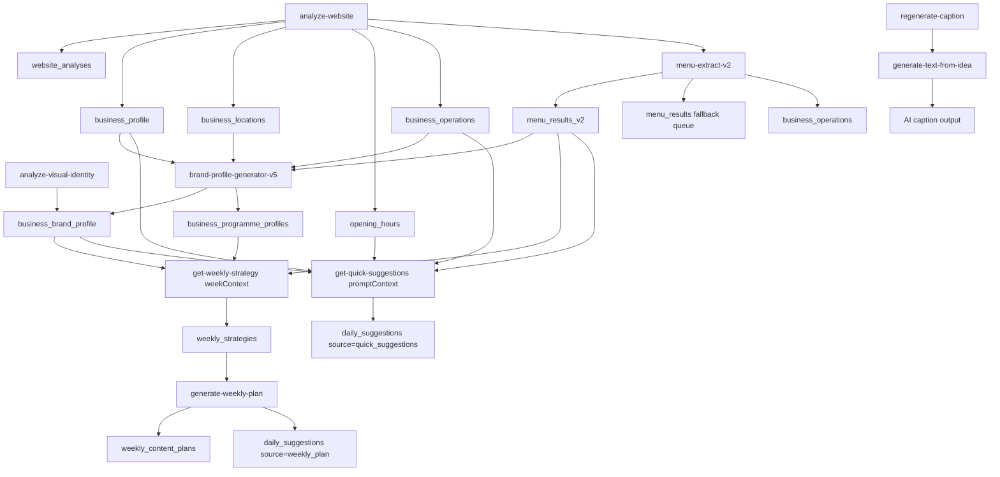

# Prompt / Database Data Map

**Scope**: Core content generation pipeline plus supporting enrichment functions that write prompt-critical data.

**Primary functions**: `analyze-website`, `menu-extract-v2`, `brand-profile-generator-v5`, `get-weekly-strategy`, `generate-weekly-plan`, and `get-quick-suggestions`.

**Supporting functions**: `analyze-visual-identity`, `regenerate-caption`.

This document maps the data that each function receives, the prompt-shaped payload it builds, and the database rows it writes. It is a schema guide, not an implementation note.

**Note on versions**: `get-quick-suggestions-v2` is deployed but not active. Frontend still uses v1. This map documents the actively-used v1.

### Verification standard

This map is meant to be used as a contract. Each field should be interpreted using this status model:

| Status | Meaning |
| --- | --- |
| `verified-write` | The field is written by current code and the write path was checked against source. |
| `verified-read` | The field is actively read by current code and the read path was checked against source. |
| `derived` | The field is computed from other fields, not written verbatim by the model. |
| `legacy-compatible` | The field exists for backward compatibility and should not be treated as primary source of truth. |
| `deprecated` | The field is explicitly nulled, ignored, or should not be used for new work. |
| `implementation-note` | Useful context, but not part of the stable data contract. |

### Contract rule

Use the most specific verified field available. If a field appears in both a canonical JSONB structure and a flattened compatibility column, prefer the canonical JSONB structure unless this document explicitly marks the flattened column as the active contract.

## End-to-end flow



## 1) menu-extract-v2

### Role

Canonical menu ingestion function. It validates access, normalizes a menu URL, extracts structured menu data from HTML or PDF, and persists the extraction into `menu_results_v2` for downstream planning, brand profile generation, and quick suggestions.

### Review notes

- Verified against `supabase/functions/menu-extract-v2/index.ts`.
- This is the canonical writer for `menu_results_v2`.
- The stable downstream handoff is the completed row, not the transient queue job.
- HTML and PDF share the same output contract, but the PDF path may use a fast-path edge parse or a queued Cloud Run fallback.
- `structured_data`, `ai_summary`, `representative_dishes`, `service_period_name`, and `language_code` are the main fields consumed downstream.

### Input payload

| Field | Type / format | Notes |
| --- | --- | --- |
| `businessId` | string | Required. Used for access control and persistence. |
| `url` | string | Required menu URL. Validated before fetch. |
| `sourceId` | string or undefined | Optional `menu_sources.id` reference for tracking. |
| `languageCode` | string or undefined | Normalized to `da` or `en-US`; default is `da`. |

### Primary response shapes

The function has three observable outcomes:

| Outcome | Response shape | Notes |
| --- | --- | --- |
| Edge HTML/PDF success | `{ success: true, resultId, message }` | Extraction completed immediately and the `menu_results_v2` row is marked `done`. |
| Queue success | `{ success: true, resultId, message: 'Menu extraction queued (v2) - processing will start shortly' }` | The row remains queued for Cloud Run processing. |
| Error | `{ success: false, resultId?, error }` or `{ error }` | Returned for auth, validation, fetch, or extraction failures. |

### Persisted table: `menu_results_v2`

The function inserts a job row first, then updates it through the extraction lifecycle.

| Column | Type / format | Notes |
| --- | --- | --- |
| `business_id` | uuid/string | Business foreign key. |
| `source_kind` | string | Written as `url` for this path. |
| `source_url` | string | Input menu URL. |
| `source_id` | string or null | Optional tracking link to `menu_sources`. |
| `status` | string | `queued`, `processing`, `done`, or `error`. |
| `language_code` | string | AI-detected or fallback language code. |
| `source_content_type` | string or null | Observed MIME type from probe/fetch. |
| `raw_text` | string or null | HTML raw text for HTML fast path; `null` for PDF fast path. |
| `structured_data` | JSONB object | Canonical parsed menu payload, including categories and items. |
| `completed_at` | ISO datetime string | Set when extraction finishes or errors. |
| `extraction_method` | string | Examples: `edge_html`, `edge_pdf`, `cloudrun_pdf_ocr`, `cloudrun_fallback`. |
| `service_periods` | array | Canonical service period list derived from the menu. |
| `service_period_name` | string | Canonical normalized period such as `brunch`, `lunch`, `dinner`, `all_day`. |
| `is_signature` | boolean | Flag for signature-style menus. |
| `ai_summary` | string | Five-bullet helicopter summary used downstream. |
| `representative_dishes` | object | Selected 1-3 dishes for brand profile and voice generation. |
| `claimed_at` | ISO datetime string or null | Used to mark rows in processing. |
| `attempts` | number | Incremented when a worker claims the row. |
| `error_message` | string or null | Error text when status becomes `error`. |

### Additional writes

| Table | Fields written | Notes |
| --- | --- | --- |
| `business_operations` | `establishment_type`, `has_kids_menu`, `updated_at` | Saved when the extracted menu is classified as FSE or SBO. |
| `menu_results` | `business_id`, `pdf_url`, `status`, `source_type`, `language_code` | Legacy PDF queue path only. Used when the PDF cannot be handled on Edge. |

### Downstream consumers

| Consumer | Fields read | Purpose |
| --- | --- | --- |
| `brand-profile-generator-v5` | `structured_data`, `ai_summary`, `representative_dishes`, `service_period_name`, `language_code` | Builds brand profile layers and filters menus by language. |
| `menu-sync` | `structured_data`, `service_period_name` | Populates `menu_items_normalized`. |
| `menu-overview-summary` | `service_period_name`, `service_periods`, `ai_summary`, `structured_data` | Creates menu overview summaries. |
| `generate-text-from-idea` | `structured_data` | Fallback item lookup and description resolution. |
| `analyze-concept-fit` | `structured_data` | Concept matching and menu-based analysis. |
| `get-weekly-strategy` | `structured_data`, `service_periods`, `is_signature`, `ai_summary`, `source_url`, `service_period_name`, `language_code` | Strategy generation and programme alignment. |
| `get-quick-suggestions` / `get-quick-suggestions-v2` | `structured_data`, `ai_summary`, `service_period_name`, `language_code`, `cuisine_style`, `availability_days` | Tactical suggestion generation and menu intelligence. |

### Review result

This function is the canonical ingest-and-queue layer for menu data. Treat `menu_results_v2` as the primary menu source of truth, with `menu_results` only as a legacy PDF fallback queue.

## 0) analyze-website

### Role

Upstream ingestion function. It crawls a public website, extracts core business facts, menu and contact signals, and persists the results to the operational profile tables that later functions consume.

### Review notes

- Verified against `supabase/functions/analyze-website/index.ts` and `supabase/functions/_shared/persistence/website-analysis-saver.ts`.
- This function is the root data source for the downstream pipeline.
- The canonical response is the normalized `analysisResult` object plus `_persistence` metadata.
- `menuSignal` and `toneOfVoice` are the most important downstream compatibility outputs.

### Input payload

| Field | Type / format | Notes |
| --- | --- | --- |
| `url` | string | Required public business URL. Validated before any fetch. |
| `businessName` | string or undefined | Optional hint for extraction. |
| `businessType` | string or undefined | Optional business-type hint. |
| `tier` | string or undefined | Controls crawl depth and AI extraction model. |
| `debugMode` | boolean or undefined | Returns a debug payload instead of the normal response. |
| `businessId` | string or undefined | Enables persistence when present. |

### Normalized response object: `analysisResult`

The function returns `analysisResult` and appends `_persistence` metadata after the database save step.

| Path | Type / format | Notes |
| --- | --- | --- |
| `businessName` | string | Extracted or hinted business name. |
| `businessType` | string/object | Hybrid-aware business type structure from `extractBasicInfo`. |
| `businessTypeLabel` | string | Human-readable business type label. |
| `shortDescription` | string or null | Homepage/about-style summary. Saved to `business_profile.long_description`. |
| `logoUrl` | string or null | Extracted logo / icon URL. |
| `contact` | object or null | Phone, email, and address details. Saved to `business_locations`. |
| `detectedMenuUrls` | array | Candidate menu links found during crawl. |
| `offerings` | object or undefined | Menu structure and dietary options from menu extraction. |
| `takeaway` | boolean or null | Service-model signal. |
| `outdoorSeating` | boolean or null | Service-model signal. |
| `delivery` | boolean or null | Service-model signal. |
| `hasTableService` | boolean or null | Service-model signal. |
| `reservationRequired` | boolean or null | Reservation signal. |
| `wifi` | boolean or null | Service-model signal. |
| `powerOutlets` | boolean or null | Service-model signal. |
| `parking` | boolean or null | Service-model signal. |
| `kidsMenu` | boolean or null | Service-model signal. |
| `establishmentType` | string or null | FSE/SBO classification from menu extraction. Saved to `business_operations`. |
| `keywords` | string[] | Extracted keywords. |
| `venueHooks` | string[] | Concrete differentiators and positioning hooks. |
| `experiencePillars` | object/array | Content categories and supporting assets. |
| `openingHours` | object | Parsed day-by-day hours. Saved to `opening_hours`. |
| `openingHoursReviewRequired` | boolean | Manual-review flag. |
| `openingHoursReviewReasons` | string[] | Why manual review was flagged. |
| `kitchenCloseTime` | string or null | Saved to `business_operations.kitchen_close_time`. |
| `menuSignal` | object or null | Lightweight menu overview. Saved to `business_profile.menu_signal`. |
| `toneOfVoice` | object or null | Brand voice analysis. Saved to `business_profile` and used downstream. |
| `url` | string | Original URL echoed back into the response. |
| `menuUrl` | string or null | Best detected menu URL. |
| `bookingUrl` | string or null | Best detected booking URL. |
| `detectedPDFs` | array or undefined | Detected PDF menu docs. |
| `_persistence` | object | Persistence metadata with success/update/insert state. |

### Persisted tables

| Table | Fields written | Notes |
| --- | --- | --- |
| `website_analyses` | `source_url`, `status`, `last_run_at`, `raw_result` | Stores the raw analysis bundle under `raw_result.analysis`. |
| `business_profile` | `long_description`, `menu_structure`, `menu_description`, `ai_place_synopsis`, `booking_url`, `menu_signal`, `key_offerings` | Main downstream compatibility profile used by quick suggestions and other prompt builders. |
| `businesses` | `local_location_reference` | Saved from `analysisResult.localLocationReference`. |
| `business_locations` | `phone`, `email`, `address_line1`, `city`, `postal_code`, `country` | Contact/address persistence from `analysisResult.contact`. |
| `opening_hours` | `weekday`, `open_time`, `close_time`, `closed`, `kind` | Rebuilt from `analysisResult.openingHours`. |
| `business_operations` | `establishment_type`, `kitchen_close_time` | Operational classification and kitchen cutoff. |

### Downstream contract value

The most important downstream fields are `business_profile.menu_signal`, `business_profile.key_offerings`, `business_profile.long_description`, `business_profile.ai_place_synopsis`, `business_operations.kitchen_close_time`, `businesses.local_location_reference`, and `opening_hours`. These are the data surfaces later functions use to avoid dead ends and missing references.

### Review result

This function is the ingestion root and should be treated as the canonical writer for website-derived business facts. Any field consumed downstream but not written here should be treated as either derived later or legacy-only.

## 0b) analyze-visual-identity

### Role

Brand profile enrichment function. It analyzes uploaded venue photos using GPT-4 Vision to extract visual identity, venue atmosphere, and guest situation characteristics that are later used in content generation prompts.

### Review notes

- Verified against `supabase/functions/analyze-visual-identity/index.ts`.
- Actively used in brand profile onboarding via `useVisualIdentityAnalyzer` hook.
- Writes prompt-critical data to `business_brand_profile` that is read by `get-quick-suggestions`.
- This is the canonical source for venue visual identity fields.

### Input payload

| Field | Type / format | Notes |
| --- | --- | --- |
| `business_id` | string | Required. Business identifier. |
| `photo_paths` | string[] | Required. Array of storage paths in the `visual-identity` bucket. |
| `locale` | string or undefined | Optional locale code (`da`, `en`, `nb`, `sv`). Defaults to `da`. |

### AI extraction output

The function uses GPT-4 Vision to analyze photos and extract:

| Field | Type / format | Notes |
| --- | --- | --- |
| `visual_character` | string | Overall visual style and interior design character. |
| `recognizable_interior_identity` | string | Concrete, factual venue description used by caption pipeline. |
| `venue_scene` | string | Scene framing for content. |
| `venue_energy` | string | Energy/vibe descriptor (1-3 words: "hyggelig, livlig, intim"). |
| `guest_situation_type` | string | Guest situation type ("groups around tables", "solo workers", "couples"). |
| `dominant_colors` | string | Color palette description. |

### Persisted table: `business_brand_profile`

The function upserts visual identity fields into the brand profile.

| Column | Type / format | Notes |
| --- | --- | --- |
| `business_id` | string | Business foreign key. |
| `recognizable_interior_identity` | string | Factual venue description. **Read by `get-quick-suggestions` prompt builder.** |
| `visual_character` | string | Visual style descriptor. |
| `venue_scene` | string | Scene framing. |
| `venue_energy` | string | Energy/vibe word. **Injected as "Gæstesituation" in quick suggestions.** |
| `guest_situation_type` | string | Guest situation descriptor. **Injected in suggestion context.** |
| `venue_data_source` | string | Written as `photo_analysis`. |
| `updated_at` | ISO datetime string | Save timestamp. |

### Downstream consumers

| Consumer | Fields read | Purpose |
| --- | --- | --- |
| `get-quick-suggestions` | `recognizable_interior_identity`, `venue_energy`, `guest_situation_type`, `visual_character`, `venue_scene` | Venue identity framing in prompt context. |
| `generate-text-from-idea` | `recognizable_interior_identity` | Caption generation context. |
| Brand profile UI | All fields | Display and validation. |

### Review result

This function is the canonical writer for photo-derived venue identity. Fields written here are actively consumed by the content generation pipeline and should be treated as verified prompt-critical data.

## 1) brand-profile-generator-v5

### Role

Output-only generator. It assembles the V5 brand profile bundle and persists it into `business_brand_profile` plus `business_programme_profiles`.

### Review notes

- Verified against the current save payload in `supabase/functions/brand-profile-generator-v5/index.ts`.
- `brand_profile_v5` is the canonical source of truth for this generator.
- `marketing_manager_brief` is stored as plain text; `marketing_manager_brief_metadata` is stored separately.
- `layer_0_intelligence.usps` is an object, not a loose array, and should be treated as structured USP output.
- `business_programme_profiles` is populated from the same generator run and is part of the canonical write path, not an optional side effect.

### Prompt-shaped output: `brand_profile_v5`

The saved JSONB object has this top-level shape:

| Path | Type / format | Notes |
| --- | --- | --- |
| `version` | string | Current value written by the function is `5.1`. |
| `generated_at` | ISO datetime string | Timestamp for the profile version. |
| `generation_metadata.request_id` | string | Per-run request identifier. |
| `generation_metadata.duration_ms` | number | End-to-end generation time. |
| `generation_metadata.ai_models_used.layer_2` | string | Model name recorded for layer 2. |
| `generation_metadata.ai_models_used.layer_3` | string | Model name recorded for layer 3. |
| `generation_metadata.ai_models_used.layer_4` | string | Model name recorded for layer 4. |
| `generation_metadata.ai_models_used.layer_5` | string | Model name recorded for layer 5. |
| `layer_0_intelligence.business_type` | object | Detected business type, professional domain, confidence, reasoning. |
| `layer_0_intelligence.business_identity` | object | `system_persona` plus metadata object. |
| `layer_0_intelligence.menu_overview` | object or null | Cross-menu summary, totals, breakdown, signature themes. |
| `layer_0_intelligence.city_context_ai` | object or null | AI city context, cached metadata, tone, characteristics. |
| `layer_0_intelligence.geographic_context` | object | Postal code, city, population, location type, signature reference, narrative. |
| `layer_0_intelligence.usps` | object | Extracted unique selling points from layer 0, including `primary_usp`, `secondary_usps`, and `synthesis_reasoning`. |
| `layer_0_intelligence.professional_persona` | object | Legacy persona compatibility block. |
| `layer_0_intelligence.voice_archetype` | object | Voice rules, formality, structure, priorities. |
| `layer_1_programmes` | array | Programme objects with type, name, timeWindow, daysOfWeek, confidence, evidence, commercial orientation, audience segments. |
| `voice` | object | Voice profile, writing examples, guardrails, tone DNA, examples. |
| `voice.writing_examples` | object | Opening/closing/signature examples, good/bad examples, CTA library (v5.6). |
| `voice.writing_examples.typical_openings` | string[] | Brand-specific opening phrases. |
| `voice.writing_examples.typical_closings` | string[] | Brand-specific closing phrases. |
| `voice.writing_examples.signature_phrases` | string[] | Brand-specific signature phrases. |
| `voice.writing_examples.good_examples` | string[] | Complete caption examples showing voice in practice. |
| `voice.writing_examples.cta_library` | object | NEW v5.6: Intent-based, brand-specific CTA texts (visit, booking, engagement, social_media, signature_closing). |
| `voice.writing_examples.cta_library.visit.casual` | string[] | Informal visit CTAs matching brand voice. |
| `voice.writing_examples.cta_library.visit.formal` | string[] | Formal visit CTAs matching brand voice. |
| `voice.writing_examples.cta_library.booking.soft` | string[] | Gentle booking encouragement CTAs. |
| `voice.writing_examples.cta_library.booking.urgent` | string[] | Urgent booking CTAs creating urgency. |
| `voice.writing_examples.cta_library.engagement.question` | string[] | Question-based engagement CTAs. |
| `voice.writing_examples.cta_library.engagement.social` | string[] | Social sharing and tag-a-friend CTAs. |
| `voice.writing_examples.cta_library.social_media` | string[] | Platform-specific CTAs (Instagram/Facebook). |
| `voice.writing_examples.cta_library.signature_closing` | string or undefined | Optional brand-specific signature CTA. |
| `voice.writing_examples.cta_preferences` | object | NEW v5.6: CTA selection preferences and phrases to avoid. |
| `voice.writing_examples.cta_preferences.default_style` | 'casual' or 'formal' | Default tone for visit CTAs. |
| `voice.writing_examples.cta_preferences.booking_priority` | 'soft' or 'urgent' | Default booking intensity. |
| `voice.writing_examples.cta_preferences.avoid_phrases` | string[] | Phrases to never use (e.g., outdated slang like "Svip forbi"). |
| `guardrails` | object | Never-say, exclusions, factual constraints, avoid patterns. |
| `marketing_manager_brief` | string | Stage 2 marketing brief text. |
| `marketing_manager_brief_metadata` | object | Brief metadata and generation details, stored separately from the brief text. |

### Persisted table: `business_programme_profiles`

One row per deduplicated programme. The function upserts on `business_id, programme_type`.

| Column | Type / format | Notes |
| --- | --- | --- |
| `business_id` | uuid/string | Business foreign key. |
| `programme_type` | string | Machine type key for the programme. |
| `programme_name` | string | Human-readable programme label. |
| `time_windows` | string[] | Stored as a list like `['09:00-12:00']`. |
| `operating_days` | string[] | Weekday list. |
| `menu_evidence` | array/object | Supporting menu evidence captured from analysis. |
| `confidence` | number | Normalized confidence: `0.9`, `0.7`, or `0.5`. |
| `is_active` | boolean | Always written `true` for RLS visibility. |
| `baseline_goal_split` | object | Goal split object used by weekly strategy. |
| `decision_timing` | object/string | Commercial decision timing structure. |
| `content_type_affinity` | object | Content affinity structure. |
| `commercial_reasoning` | string | Narrative justification for the programme. |
| `price_positioning` | object/string/null | Per-programme pricing position. |
| `audience_segments` | array | Segment list with name, motivation, timing preference, content angle, confidence. |
| `segment_confidence` | number | Confidence for the segment inference. |
| `segment_reasoning` | string | Reasoning for the segment inference. |
| `created_at` | ISO datetime string | Set at save time. |
| `updated_at` | ISO datetime string | Set at save time. |

### Persisted table: `business_brand_profile`

The function upserts the V5 JSONB source of truth plus flattened compatibility columns.

| Column | Type / format | Notes |
| --- | --- | --- |
| `business_id` | uuid/string | Primary business key. |
| `business_archetype` | string | Derived archetype such as `cafe_bar`, `fine_dining`, `coffee_shop`, etc. |
| `brand_profile_v5` | JSONB object | Full V5 profile bundle described above. |
| `brand_profile_v5_generated_at` | ISO datetime string | Mirrors `brand_profile_v5.generated_at`. |
| `brand_profile_v5_version` | string | Mirrors `brand_profile_v5.version`. |
| `enhanced_social_examples` | array | Flattened from the V5 voice block. |
| `enhanced_avoid_examples` | array | Flattened from the V5 voice block. |
| `social_writing_examples` | array | Legacy compatibility examples. |
| `voice_guardrails` | object | Fast-access flattened guardrails. |
| `business_identity_persona` | string | Full business identity persona text. |
| `marketing_manager_brief` | string | Flattened Stage 2 brief for fast access. |
| `commercial_baseline_mode` | string or null | Aggregated programme goal mode. |
| `strategic_audience_segments` | array/object | Strategic audience segment set. |
| `content_strategy` | object or null | Derived weekly-plan compatibility structure. |
| `business_character` | string | Short strategic reasoning text used downstream. |
| `tone_of_voice` | null | Explicitly nulled in this generator. |
| `updated_at` | ISO datetime string | Save timestamp. |
| `created_at` | ISO datetime string | Save timestamp. |

### Important format notes

| Field | Format rule |
| --- | --- |
| `content_strategy` | Derived from active programme commercial orientations, not written directly by the prompt model. |
| `strategic_audience_segments` | Flattened array for downstream consumers that still read the legacy column. |
| `business_character` | Short free-form summary, not the full persona text. |
| `tone_of_voice` | Explicitly cleared to prevent stale legacy values from persisting. |

### Review result

All fields in this section are treated as verified current contract fields except `tone_of_voice`, which is deprecated and intentionally nulled. The flattened compatibility columns are retained because downstream code still reads them, but they should be treated as secondary to `brand_profile_v5`.

## 2) get-weekly-strategy

### Role

Builds a `WeekContext` prompt payload, runs the weekly strategy generator, stores the context snapshot, and persists the resulting strategy into `weekly_strategies`.

### Review notes

- Verified against the current `WeekContext` type and the `weekly_strategies` persistence path.
- `week_context_snapshot` is the exact prompt context the model saw and should be treated as the canonical strategy payload.
- `status` is the control field for the lifecycle of a weekly strategy row: `pending` → `generated` → `posts_created` or `error`.
- Fields under `brand_voice` are primarily compatibility and prompt-assembly inputs; they are not all equally authoritative.

### Prompt payload: `weekContext`

This is the actual structured input used to drive the strategy prompt. It is also persisted in `weekly_strategies.week_context_snapshot`.

| Group | Field | Type / format | Notes |
| --- | --- | --- | --- |
| Identity | `business_id` | string | Business key. |
| Identity | `business_name` | string | Display name. |
| Identity | `business_type` | string | Legacy business type key. |
| Identity | `business_character` | string or undefined | Short strategic type reasoning. |
| Identity | `business_archetype` | string | Derived structural archetype. |
| Identity | `business_mode` | string | Operational mode from interpretation layer. |
| Identity | `business_drivers` | array/object | Strategic driver ranking. |
| Identity | `revenue_drivers` | object or null | Brand-profile revenue driver signal. |
| Timing | `week_number` | number | ISO-ish week number. |
| Timing | `week_start` | ISO date string | Monday start. |
| Timing | `week_end` | ISO date string | Sunday end. |
| Timing | `available_days` | string[] | Dates the business can post. |
| Timing | `daily_open_time` | record<string, string \| null> | Per-day opening times. |
| Timing | `daily_close_time` | record<string, string \| null> | Per-day closing times. |
| Timing | `opening_hours_summary` | string or undefined | Human-readable opening-hours narrative. |
| Timing | `booking_link` | string or null | Reservation URL. |
| Timing | `booking_model` | object | Reservation/walk-in/booking-link boolean matrix. |
| Timing | `cta_rules` | object | Derived instruction object with mode, instruction, lead-days. |
| Timing | `is_current_week` | boolean | Whether the request targets the current week. |
| Timing | `preferred_posts_per_week` | number | Target post count. |
| Menu | `menu_programmes` | array or null | Operational service-period programmes from menu signal extraction. |
| Menu | `signature_items` | array | Balanced menu item list with id, name, description, category, price, signature flag, service periods. |
| Menu | `menu_summaries` | array or undefined | Per-menu AI summaries. |
| Menu | `seasonal_ingredients` | string[] | Seasonal ingredient hints. |
| Location | `city` | string | City name. |
| Location | `country` | string | Country code. |
| Location | `location` | object | Location type, neighborhood, area type, outdoor seating, takeaway/table service, local reference, tourist context. |
| Weather | `weather` | object | Full week weather object. |
| Weather | `weather_interpretation` | object | Derived weather meaning for the business. |
| Season | `season` | object | Seasonal context plus mood signals. |
| Events | `events` | array | Upcoming event records. |
| Economy | `economic` | object | Economic timing context. |
| History | `previous_week` | object | Prior-week performance summary and selections. |
| Brand voice | `brand_voice` | object | Brand profile subset passed into the prompt. |
| Brand voice | `brand_voice.brand_profile_v5` | JSONB object or null | Full V5 source of truth. |
| Brand voice | `brand_voice.tone_dna` | object or null | Tone DNA payload. |
| Brand voice | `brand_voice.tone_rules` | array | Tone rules. |
| Brand voice | `brand_voice.tone_positioning` | string | Recommended tone positioning. |
| Brand voice | `brand_voice.voice_style` | string | Derived voice style. |
| Brand voice | `brand_voice.do_not_say` | object | Legacy avoid data. |
| Brand voice | `brand_voice.content_pillars` | object | Legacy content pillars. |
| Brand voice | `brand_voice.never_say` | string[] | Hard blocklist. |
| Brand voice | `brand_voice.typical_openings` | string[] | Example openings. |
| Brand voice | `brand_voice.core_offerings` | object|string|null | Offerings summary. |
| Brand voice | `brand_voice.brand_essence` | string | Legacy identity anchor. |
| Brand voice | `brand_voice.tone_of_voice` | any | Legacy compatibility fallback. |
| Brand voice | `brand_voice.voice_guardrails` | object|null | Flattened guardrails. |
| Brand voice | `brand_voice.enhanced_social_examples` | array | Flattened examples. |
| Brand voice | `brand_voice.enhanced_avoid_examples` | array | Flattened negative examples. |
| Brand voice | `brand_voice.booking_cta_phrases` | string[] | LEGACY: Approved booking CTA phrases. Replaced by brand_profile_v5.voice.writing_examples.cta_library (v5.6). |
| Brand voice | `brand_voice.cta_library` | object|null | NEW v5.6: Structured brand-specific CTA library with intent-based categories (visit, booking, engagement, social_media). |
| Brand voice | `brand_voice.cta_preferences` | object|null | NEW v5.6: CTA selection preferences (default_style, booking_priority, avoid_phrases). |
| Brand voice | `brand_voice.gastronomic_profile` | object|null | Legacy gastronomic profile. |
| Brand voice | `brand_voice.tone_model` | object|null | Legacy tone model. |
| Brand voice | `brand_voice.content_strategy` | object|null | Includes `goal_blend`, and may be augmented with weekly modulation fields. |
| Brand voice | `brand_voice.recognizable_interior_identity` | string|null | Verified factual venue description. |
| Commercial | `posting_strategy` | object|null | AI-assessed optimal slot window context. |
| Commercial | `busy_pattern` | object|null | Busy/quiet pattern signal. |
| Commercial | `target_type_mix` | object|null | Parsed content-type mix. |
| UI/owner | `owner_note` | string or undefined | Free-text owner guidance. |
| UI/owner | `platforms` | string[] | Active platforms. |
| UI/owner | `subscription_tier` | string | Tier key, usually `smart` or `pro`. |

### Persisted table: `weekly_strategies`

The function creates or updates a pending row first, then saves the full strategy in the background.

| Column | Type / format | Notes |
| --- | --- | --- |
| `business_id` | string | Business key. |
| `week_number` | number | Week number. |
| `week_start` | ISO date string | Monday. |
| `week_end` | ISO date string | Sunday. |
| `is_current_week` | boolean | Current-week flag. |
| `business_type` | string | Business type key. |
| `country` | string | Country code. |
| `platforms` | string[] | Active platforms. |
| `subscription_tier` | string | Subscription tier. |
| `strategy_version` | string | Written as `v2.2.0_brand_v5`. |
| `generated_at` | ISO datetime string | Save timestamp. |
| `status` | string | `pending`, `generated`, `posts_created`, or `error`. |
| `strategic_brief` | object | Generated strategic brief. |
| `strategic_brief_raw` | string | Raw model output. |
| `narrative` | object | User-facing strategy narrative. |
| `strategic_priorities` | array | Machine-readable priorities. |
| `post_ideas` | array | Post idea objects, each with the fields below. |
| `week_context_snapshot` | object | The complete prompt context. |
| `target_post_count` | number | Number of requested/generated ideas. |
| `strategy_rationale` | string or null | Concatenated rationale summary. |
| `selected_idea_ids` | number[] or null | Populated when the plan is executed. |

### `weekly_strategies.post_ideas` shape

Each idea is stored as a structured object. The important fields are:

| Field | Type / format | Notes |
| --- | --- | --- |
| `id` | number | Stable idea identifier. |
| `title` | string | Human-readable post title. |
| `rationale` | string | Strategic rationale. |
| `content_type` | string | Final content type after allocation. |
| `suggested_media` | object | Media direction / why / type. |
| `platforms` | string[] | Platforms the idea fits. |
| `weather_dependent` | boolean | Weather-sensitive idea. |
| `weather_flag` | string or null | Weather constraint or note. |
| `estimated_performance` | string | Usually `high`, `medium`, or `low`. |
| `strategic_fit` | number | Scoring value. |
| `goal_mode` | string | Goal mode such as `drive_footfall`, `build_brand`, `retain_loyalty`. |
| `content_category` | string | Category such as `product_menu`, `craving_visual`, `behind_scenes`, `team_people`. |
| `slot_id` | string | Slot assignment key. |
| `owner_note_applied` | boolean | Whether owner note influenced the idea. |
| `drink_pairing` | string or null | Optional drink pairing. |
| `strategic_intent` | string or null | Phase 1 narrative intent. |
| `nudge_rationale` | string or null | Booking-nudge explanation. |
| `peak_day` | ISO date string or null | Target visit day. |
| `lead_days_used` | number or null | Booking lead time used. |
| `booking_nudge_warranted` | boolean or null | Whether the nudge was approved. |
| `timing_rationale` | string or null | Context-driven timing rationale. |

### Status flow

| Step | Database effect |
| --- | --- |
| Request accepted | Pending row is inserted or updated with `status=pending`. |
| Strategy generated | Row is rewritten with full `strategic_brief`, `narrative`, `strategic_priorities`, and `post_ideas`. |
| Plan executed | `generate-weekly-plan` later updates `weekly_strategies.status` to `posts_created` and writes `selected_idea_ids`. |
| Failure | `status=error`. |

### Review result

The full strategy record is contractually important, but the operational source of truth for the prompt is `week_context_snapshot`. If a field is only present in the prompt assembly and not persisted there, it should be treated as non-canonical.

## 3) generate-weekly-plan

### Role

Consumes the saved weekly strategy and turns it into a persisted weekly plan plus concrete daily suggestion rows.

### Review notes

- Verified against `supabase/functions/generate-weekly-plan/index.ts` and `supabase/functions/_shared/post-helpers/weekly-plan-generator.ts`.
- `weekly_content_plans.posts` is the canonical weekly-plan payload.
- `strategicContext` is the handoff surface from the strategy layer into plan generation.
- `daily_suggestions` rows written from this function are derived executions of weekly strategy ideas and should keep `source=weekly_plan`.

### Prompt / input bundle: `GenerationInput`

The function receives the strategy payload plus live business context.

| Group | Field | Type / format | Notes |
| --- | --- | --- | --- |
| Identity | `userId` | string | Owner / user id. |
| Identity | `businessId` | string | Business id. |
| Identity | `businessType` | string | Business type key. |
| Timing | `weekStart` | Date | Week start date object. |
| Strategy | `strategy` | `WeeklyStrategy` object | Required in the strategy-driven path. |
| Strategy | `strategyId` | string | Source `weekly_strategies` id. |
| Strategy | `selectedIdeaIds` | number[] or undefined | Optional idea subset. |
| Context | `brandProfile` | object | Brand profile bundle. |
| Context | `businessProfile` | object | Business profile context. |
| Context | `businessOps` | object | Operating-hours / kitchen context. |
| Context | `locationIntel` | object | Location intelligence. |
| Context | `menuItems` | array | Menu item list. |
| Context | `platforms` | string[] | Active platforms. |
| Context | `previousPlans` | array | Prior plans for variation tracking. |
| Context | `contextEvents` | array | Holiday / event context. |
| Tier | `subscriptionTier` | string | Tier key. |
| Tier | `targetPostCount` | number | Requested target count. |

### Persisted table: `weekly_content_plans`

The save function stores the full weekly plan as a JSON blob and updates the latest row for the same business/week if one exists.

| Column | Type / format | Notes |
| --- | --- | --- |
| `user_id` | string | Owner id. |
| `business_id` | string | Business id. |
| `week_number` | number | ISO week number. |
| `week_start` | ISO date string | Week start. |
| `week_end` | ISO date string | Week end. |
| `generated_at` | ISO datetime string | Save timestamp. |
| `strategy_id` | string or null | Back-reference to `weekly_strategies`. |
| `posts` | array | Full `PostSpecification[]` JSON payload. |
| `summary` | object | Aggregate plan summary. |
| `learning_data` | object or null | Optional learning metadata. |

### `weekly_content_plans.posts` shape

Each post is stored as a nested `PostSpecification` object. The fields most relevant to database persistence are:

| Field | Type / format | Notes |
| --- | --- | --- |
| `selectionRationale` | string | Why the post was chosen. |
| `timing` | object | Day, date, time, rationale, timingRationale. |
| `platformFormat` | object | Platform and format metadata. |
| `postType` | object | Type/category/priority/goal_mode. |
| `contentSubject` | object | Dish/content subject plus menu item identifiers. |
| `opportunity` | object or null | Scoring and selection explanation. |
| `caption` | object | Caption text and metadata. |
| `visualDirection` | object | Creative direction and technical specs. |
| `productionNotes` | object | Logistics / production guidance. |
| `alternatives` | array | Alternative ideas. |
| `media` | object | Media status and uploads. |
| `approval` | object | Approval workflow state. |
| `strategicContext` | object or null | Layer 0 strategic context, including `cta_intent`, `suggested_media`, `strategic_fit`, `weather_dependent`, `estimated_performance`, `goal_mode`, `content_category`, `slot_id`, `rationale`, `strategic_intent`, and booking-nudge metadata. |
| `idea_id` | number | Flattened compatibility field. |
| `title` | string | Flattened compatibility field. |
| `cta_text` | string | Flattened compatibility field. |
| `visual_direction` | string | Flattened compatibility field. |
| `suggested_day` | string | Flattened compatibility field. |
| `suggested_post_time` | string | Flattened compatibility field. |
| `holiday_context` | object or null | Holiday annotation when relevant. |

### Persisted table: `daily_suggestions` from weekly-plan execution

When `originalIdeas` are available, the save function also writes per-day rows to `daily_suggestions`.

| Column | Type / format | Notes |
| --- | --- | --- |
| `business_id` | string | Business id. |
| `title` | string | Post title. |
| `rationale` | string | Selected rationale. |
| `content_type` | string | Content type from the idea. |
| `suggested_time` | string \| null | HH:MM time or null. |
| `date` | ISO date string | Planned date. |
| `position` | number | Per-day position, capped at 3. |
| `source` | string | Written as `weekly_plan`. |
| `status` | string | Written as `available`. |
| `menu_item_id` | string or null | Menu item UUID if present. |
| `menu_item_name` | string or null | Exact menu item name. |
| `menu_item_description` | string or null | Menu item description. |
| `validation_result` | object or null | Strategy validation result. |
| `inferred_content_type` | string or null | Derived content type. |

### Weekly strategy status update

After a successful save, the function updates the source strategy row:

| Column | Type / format | Notes |
| --- | --- | --- |
| `status` | string | Set to `posts_created`. |
| `selected_idea_ids` | number[] | Derived from executed posts. |

### Review result

The weekly plan section is fully contract-relevant. `weekly_content_plans.posts` is the main artifact to inspect when validating whether downstream code can safely consume plan outputs without reaching for stale legacy columns.

## 4) get-quick-suggestions

### Role

Builds a slot-by-slot prompt for Gemini, normalizes the returned suggestion objects, persists them to `daily_suggestions`, and increments the quick-suggestions counter on regenerate.

### Review notes

- Verified against the refactored modular implementation and the current `promptContext` assembly.
- **Updated June 24, 2026**: Phases 0-3 improvements deployed:
  - **Phase 0**: Cuisine intelligence using `menu_results_v2.ai_summary` (100% detection rate)
  - **Phase 1**: Unified B+C prompts (4 → 2 AI calls, 50% reduction)
  - **Phase 2**: Simplified output validator (585 → 116 lines, 80% reduction)
  - **Phase 3**: Simplified response structure (15 → 12 core fields, removed redundant title/rationale/caption_base)
- **Bug Fixes June 24, 2026**:
  - **Dynamic calculator closing time bug**: Fixed `isAfterClosing` check to use `effectiveClosingMins` (kitchen close or venue close) instead of `closingMins` (venue close only). Bug caused "AFTER CLOSING" status at 13:31 when kitchen closes at 21:30 but venue closes at 00:00 (midnight = 0 mins).
  - **Post-service timing guard**: Added validation to prevent AI from suggesting ended service periods (e.g., "Vi serverer frokost lige nu" when current time is after frokost end time). Prompts now include explicit warnings and next-service framing when a programme has ended.
  - **Rotation language removal**: Removed "Aldrig fremhævet endnu" / "Sidst fremhævet for X dage siden" prompt patterns. Shifted focus from rotation status to contextual relevance (taste, ingredients, timing, audience fit).
  - **Enhanced debug logging**: Added comprehensive slot count calculation logging to troubleshoot timing and slot count issues (current time, kitchen close, hours remaining, service state, reasoning).
- The architecture inventory below is informational only and should not be mistaken for part of the data contract.
- The canonical contract for this function is the prompt bundle, the normalized Gemini output, and the `daily_suggestions` write path.

### Implementation notes (non-canonical)

The function has been refactored from a monolithic 4,362-line file into a modular architecture with 7 focused modules:

| Module | Lines | Responsibility |
| --- | --- | --- |
| `types.ts` | 243 | Centralized type definitions (simplified Suggestion interface in Phase 3) |
| `cache-manager.ts` | 186 | Cache validation (45-min staleness) and cached response assembly |
| `context-fetcher.ts` | 366 | Parallel database fetching (business, operations, location, menu, brand, etc.) |
| `brand-context-builder.ts` | 244 | Brand profile assembly for AI prompts (V5 fallback chain, persona matching) |
| `suggestion-persister.ts` | 353 | Database persistence, batch ID generation, quota management |
| `ai-client.ts` | 216 | Gemini API communication with structured JSON response handling (Phase 1: added callGeminiArray for unified B+C) |
| `prompt-builder.ts` | 132 | System instruction loading and day framing generation |
| `output-validator.ts` | 116 | **Phase 2 simplified**: Basic field validation only, trusts Gemini 2.5 Flash quality (down from 585 lines) |
| `index.ts` | 3,755 | Main orchestration logic coordinating all modules (Phase 1: unified B+C prompt generation) |

**Key architectural improvements:**

- **Separation of concerns:** Each module has a single, clear responsibility
- **Testability:** Individual modules can be unit tested in isolation
- **Maintainability:** Clear module boundaries with documented interfaces
- **Type safety:** Centralized type definitions eliminate duplication
- **Performance:** Parallel context fetching preserved (`fetchAllBusinessContext`)
- **Phase 0-3 optimizations (June 2026)**:
  - Cuisine intelligence via `menu_results_v2.ai_summary` (no new AI calls)
  - Unified B+C prompts reduce AI calls from 4 to 2 (50% latency reduction)
  - Simplified output validator trusts Gemini quality (469 lines removed)
  - Response structure simplified (3 redundant fields removed)

The refactoring reduced `index.ts` by 662 lines (15.1%) while adding 1,642 lines of well-organized, maintainable code across the focused modules. Phase 2 further reduced output-validator.ts by 80% (585 → 116 lines).

**Module data flow:**

```
┌─────────────────────────────────────────────────────────────────┐
│ index.ts (Orchestration)                                        │
└─────────────────────────────────────────────────────────────────┘
          │
          ├──> cache-manager.ts
          │     └──> checkCache() → CacheCheckResult
          │     └──> buildCachedResponse() → QuickSuggestionsResponse
          │
          ├──> context-fetcher.ts
          │     └──> fetchAllBusinessContext() → BusinessContext
          │          ├──> Parallel DB fetches (business, operations, location, menu)
          │          └──> getMenuRotationQueue() for dish metadata
          │
          ├──> brand-context-builder.ts
          │     └──> buildBrandContext() → BrandContext
          │          ├──> extractBusinessCharacter() (V5 fallback chain)
          │          └──> matchCurrentPersona() (programme-based matching)
          │
          ├──> prompt-builder.ts
          │     ├──> buildDagensSystemInstruction() → system prompt
          │     └──> generateDayFraming() → contextual day framing
          │
          ├──> ai-client.ts
          │     ├──> getGeminiApiKey() → validated API key
          │     └──> callGemini() → parsed suggestion object
          │          └──> Gemini API call with structured JSON response
          │
          └──> suggestion-persister.ts
                └──> persistAndAssemble() → final suggestions array
                     ├──> Generate batch ID for tracking
                     ├──> Deactivate old suggestions (if regenerate)
                     ├──> Match dishes to rotation queue (menu_item_id)
                     ├──> Determine content angles (weather + dish analysis)
                     ├──> Time collision guard (ensure unique posting times)
                     ├──> Upsert to daily_suggestions table
                     └──> Increment quota counter (if regenerate)
```

**Module public APIs:**

| Module | Key Exports | Notes |
| --- | --- | --- |
| `types.ts` | `QuickSuggestionsRequest`, `QuickSuggestionsResponse`, `BusinessContext`, `CacheCheckResult`, `MenuItem`, `BrandProfileRow`, etc. | All shared type definitions (Phase 3: simplified Suggestion interface) |
| `cache-manager.ts` | `checkCache()`, `buildCachedResponse()` | 45-min staleness threshold, corruption detection |
| `context-fetcher.ts` | `fetchAllBusinessContext()` | Parallel fetching, rotation queue with shuffle logic (Phase 0: includes cuisine_context from menu_results_v2.ai_summary) |
| `brand-context-builder.ts` | `buildBrandContext()`, `extractBusinessCharacter()`, `matchCurrentPersona()` | V5 fallback chain, programme-based persona matching |
| `suggestion-persister.ts` | `persistAndAssemble()`, `determineContentAngle()` | Batch ID generation, quota management, content angle determination |
| `ai-client.ts` | `callGemini()`, `callGeminiArray()`, `getGeminiApiKey()` | Structured JSON response handling, API key validation (Phase 1: callGeminiArray for unified B+C) |
| `prompt-builder.ts` | `buildDagensSystemInstruction()`, `generateDayFraming()`, `buildUnifiedPromptBC()` | System prompt assembly, contextual day framing (Phase 1: unified B+C prompt generation) |
| `output-validator.ts` | `simpleValidate()`, `validateAndRepair()` (legacy compat) | Phase 2: Minimal validation, trusts Gemini 2.5 Flash quality (no repairs) |

### Review result

The prompt contract in this section is verified, but the module inventory is implementation detail. If the implementation changes again, only the module notes should move; the field contract and write path should remain stable.

### Prompt input bundle: `promptContext`

The prompt context is assembled from business, operations, menu, weather, audience, and voice fields. The builder then expands those inputs into `sharedCtx`, `sharedRules`, menu blocks, avoid sections, and slot-specific prompts before calling the model.

| Group | Field | Type / format | Notes |
| --- | --- | --- | --- |
| Identity | `businessName` | string | Business name. |
| Identity | `effectiveVertical` | string | Active vertical chosen for the current hour. Computed from `business_type_hybrid.primary` via detection helpers. |
| Identity | `isHybridBusiness` | boolean | Hybrid business flag. |
| Identity | `businessCharacter` | string | Short identity / reasoning anchor. |
| Identity | `cuisineStyle` | string or undefined | **Phase 0**: Cuisine style parsed from `menu_results_v2.ai_summary` (100% detection rate, 15 cuisine types). |
| Identity | `identityKeywords` | string | Keyword list. |
| Identity | `visualCharacter` | string | Venue visual character. |
| Identity | `venueScene` | string | Venue scene framing. |
| Identity | `venueEnergyText` | string | Venue energy description. |
| Identity | `guestSituation` | string | Guest situation framing. |
| Identity | `emotionalPromise` | string | Emotional promise / hook. |
| Location | `city` | string | City. |
| Location | `country` | string | Country. |
| Location | `localLocationReference` | string or undefined | Local reference point. |
| Operations | `todayOpenTime` | string | Opening time. |
| Operations | `todayCloseTime` | string | Closing time. |
| Operations | `kitchenCloseTime` | string | Kitchen closing time. |
| Operations | `activeServicePeriod` | string | Active service period. |
| Operations | `priceLevel` | string or number | Price-level signal. |
| Programs | `currentProgram` | object or undefined | Current programme window. |
| Programs | `allPrograms` | array or undefined | Full programme list. |
| Day/time | `dayName` | string | Danish day name. |
| Day/time | `dayBehavior` | string | Day behavior descriptor. |
| Day/time | `isWeekend` | boolean | Weekend flag. |
| Day/time | `currentHour` | number | Current hour in local time. |
| Weather/season | `weatherInfo` | string | Weather summary string. |
| Weather/season | `season` | string | Season label. |
| Weather/season | `outdoorNote` | string | Outdoor seating note. |
| Weather/season | `outdoorSuitability` | boolean | Outdoor suitability flag. |
| Weather/season | `outdoorProhibitionBlock` | string | Block when outdoor messaging should be avoided. |
| Audience | `targetAudienceText` | string | Main audience text. |
| Audience | `activeSegmentAngle` | string | Current segment angle. |
| Audience | `audienceBreadth` | string | Breadth of the current audience framing. |
| Audience | `businessModelType` | string | Business model type used by the prompt builder. |
| Audience | `primaryCopyHook` | string | Main copy hook. |
| V5 guidance | `v5ToneNote` | string | Tone note. |
| V5 guidance | `v5CTAType` | string | CTA type guidance. |
| V5 guidance | `v5ContentAngles` | string[] or undefined | Content-angle list. |
| Menu | `menuCategories` | array | Menu category objects. |
| Menu | `signatureItems` | array | Signature items. |
| Menu | `timeAppropriateItems` | array or undefined | Optional prioritization subset. |
| Menu | `menuDescriptionMap` | map | Name → trusted description. |
| Menu | `socialLeadLabel` | string or undefined | Lead label for social framing. |
| Menu | `menuLanguage` | string | Menu language. |
| Facts | `confirmedFacts` | string[] | Confirmed facts for Slot A. |
| Facts | `confirmedFactsSlotB` | string[] | Confirmed facts for Slot B. |
| Facts | `calendarEventFacts` | string[] | Calendar event facts. |
| Facts | `locationMarketingHooks` | string[] | Location hooks. |
| Facts | `menuIntelligenceFacts` | string[] | Menu intelligence facts. |
| Constraints | `hasKidsMenu` | boolean | Kids-menu flag. |
| Constraints | `hasTakeaway` | boolean | Takeaway flag. |
| Constraints | `hasOutdoorSeating` | boolean | Outdoor seating flag. |
| Constraints | `hasTableService` | boolean | Table-service flag. |
| Strategy | `contentExclusions` | string | Content exclusions block. |
| Strategy | `conceptFitAvoid` | array | Concepts to avoid. |
| Strategy | `disabledSlots` | string[] | Slots that should not be suggested. |
| History | `recentSuggestions` | array | Recent suggestions for deduplication. |
| History | `recentSlotADishes` | string[] | Dishes recently used in Slot A. |
| History | `recentSlotADishesWithAge` | array | Age-tagged dish recency. |
| History | `selectionBiasBlock` | string | Selection bias block. |
| Brand voice | `toneInstructions` | string | Tone instructions. |
| Brand voice | `voiceRationale` | string | Voice rationale text. |
| Brand voice | `isPaidTier` | boolean | Paid-tier flag. |
| Brand voice | `touristContext` | string or undefined | Tourist context flag. |
| Brand voice | `userContext` | string or undefined | User-provided note. |
| Team | `teamPeopleAnchors` | string[] or undefined | Team/people anchors for V5.6. |

### Prompt output shape

Gemini returns one JSON object per slot (Phase 1: unified call for Slots B+C), then the function normalizes and saves the resulting row. The important output fields are:

| Field | Type / format | Notes |
| --- | --- | --- |
| `why_explanation` | string | **Phase 3**: Primary reasoning field (replaces separate title/rationale). |
| `content_type` | string | Normalized to the allowed DB set. |
| `slot` | string | `offering`, `guest_moment`, or `brand_behind`. |
| `menu_item_name` | string or null | Menu item reference when relevant. |
| `dish_text_brief` | string or null | Short menu-text reference. |
| `concrete_anchor` | string or null | Factual anchor for non-menu posts. |
| `occasion_context` | string or null | Occasion framing. |
| `photo_idea` | string or null | **Phase 0**: Cuisine-aware photography guidance (80-120 chars). |
| `media_suggestion` | object or null | Media guidance. |
| `cta_intent` | string or null | CTA intent. |

**Phase 3 removed fields** (deferred to generate-text-from-idea):
- `title` - Redundant with why_explanation
- `rationale` - Duplicate of why_explanation
- `caption_base` - Generated downstream by generate-text-from-idea

### Persisted table: `daily_suggestions`

The function upserts one row per slot with `source=quick_suggestions`.

**Phase 3 Note**: As of June 24, 2026, the API response has been simplified. Legacy columns (`title`, `rationale`, `caption_base`) remain in the database for backward compatibility but are NOT included in the API response `Suggestion` interface.

| Column | Type / format | Notes |
| --- | --- | --- |
| `business_id` | string | Business id. |
| `why_explanation` | string | **Phase 3**: Primary explanation field (replaces title/rationale in API response). |
| `occasion_context` | string | Occasion context. |
| `photo_idea` | string | **Phase 0**: Cuisine-aware photo instruction (80-120 chars). |
| `content_type` | string | Normalized to `product`, `atmosphere`, `bts`, `event`, or `offer`. |
| `suggested_time` | string | HH:MM, with collision handling if needed. |
| `date` | ISO date string | Suggestion date. |
| `position` | number | Slot index, starting at 1. |
| `source` | string | Written as `quick_suggestions`. |
| `status` | string | Written as `available`. |
| `generation_batch_id` | uuid/string | Batch id for the generation run. |
| `weather_forecast` | object or null | Parsed weather forecast JSON. |
| `menu_item_id` | string or null | Menu item UUID when matched. |
| `menu_item_name` | string | Menu item name. |
| `service_period` | string or null | Ground-truth service period from menu data. |
| `content_angle` | string or null | Strategic angle for the slot. |
| `menu_item_description` | string | Trusted menu description. |
| `cta_intent` | string | Usually `social`, `engagement`, or `visit`. |
| `media_suggestion` | object or null | Media guidance object. |
| `slot` | string | **Phase 3**: Added to API response for slot identification. |
| `suggestion_date` | ISO date string | **Phase 3**: Added to API response. |

**Legacy columns (database only, not in API response as of Phase 3)**:
- `title` - Database column retained for compatibility, not in Suggestion interface
- `rationale` - Database column retained for compatibility, not in Suggestion interface
- `caption_base` - Database column retained for compatibility, not in Suggestion interface

### Counter update

If the request is a regeneration, the function increments:

| Column | Type / format | Notes |
| --- | --- | --- |
| `businesses.quick_suggestions_today` | number | Incremented by 1 after save. |

## 5) regenerate-caption

### Role

Text regeneration wrapper function. It delegates to `generate-text-from-idea` to regenerate a single post caption using the full AI prompt system (not the weaker plan-post-prompt). Ensures regeneration gets the same quality context as initial generation.

### Review notes

- Verified against `supabase/functions/regenerate-caption/index.ts`.
- Actively used in post creation flow.
- Does not write directly to database — delegates all generation to `generate-text-from-idea`.
- This is a wrapper function, not a data persistence layer.

### Input payload

| Field | Type / format | Notes |
| --- | --- | --- |
| `post` | object | Post specification object with content details. |
| `businessId` | string | Required. Business identifier. |
| `strategicContext` | object or undefined | Optional strategic context from weekly plan. |

### Processing flow

1. Validates user authentication
2. Builds `WeeklyPlanSuggestion` payload from input post
3. Calls `generate-text-from-idea` edge function
4. Returns generated caption with full prompt context:
   - UGEPLANKONTEKST weekly frame
   - `goal_mode` directive (drive_footfall / build_brand / retain_loyalty)
   - faktaforbud (no hallucinated facts)
   - sensory rules and dish description rules
   - full brand voice and tone-of-voice profile

### Persisted data

None. This function does not write to the database. All persistence is handled by `generate-text-from-idea` or the calling context.

### Downstream consumers

| Consumer | Purpose |
| --- | --- |
| Post creation UI | Caption regeneration in edit flows. |
| Weekly plan UI | Caption refresh for plan posts. |

### Review result

This function is a wrapper that ensures caption regeneration uses the full prompt system. It should be documented as a helper function, not a data writer. The canonical text generation contract is in `generate-text-from-idea`.

## Practical read order

If you are tracing a field from prompt to database, read it in this order:

1. The source function prompt bundle.
2. The normalized output object.
3. The target table write.
4. Any legacy compatibility column that re-exposes the same data.

## Notes

- `brand-profile-generator-v5` is the only function here that writes the V5 source of truth into `brand_profile_v5`.
- `analyze-visual-identity` is the canonical writer for photo-derived venue identity fields that are consumed by content generation prompts.
- `get-weekly-strategy` persists the weekly prompt context so downstream code can reuse exactly what the strategy model saw.
- `generate-weekly-plan` stores the fully assembled weekly plan and the executed daily suggestions.
- `get-quick-suggestions` writes compact slot suggestions into the same `daily_suggestions` table, but with a different source and a different schema subset. As of June 2026, the function has been refactored into a modular architecture with 7 focused modules (types, cache-manager, context-fetcher, brand-context-builder, suggestion-persister, ai-client, prompt-builder) coordinated by a 3,700-line orchestration layer in `index.ts`. Each module has a single responsibility and can be tested in isolation.
- `regenerate-caption` is a wrapper function that delegates to `generate-text-from-idea` for caption regeneration using the full prompt system.

## Canonical ownership matrix

This matrix is the shortest path from a field family to its owning write and read paths.

| Canonical data family | Written by | Primary read paths | Contract status |
| --- | --- | --- | --- |
| `brand_profile_v5` | `brand-profile-generator-v5` | `get-weekly-strategy`, `get-quick-suggestions`, `generate-weekly-plan`, supporting extractors | verified-write |
| `business_programme_profiles` | `brand-profile-generator-v5` | `get-weekly-strategy`, quick-suggestions context assembly, downstream planner helpers | verified-write |
| `business_brand_profile` visual identity fields | `analyze-visual-identity` | `get-quick-suggestions`, `generate-text-from-idea`, brand profile UI | verified-write |
| `weekly_strategies.week_context_snapshot` | `get-weekly-strategy` | `generate-weekly-plan` | verified-write |
| `weekly_content_plans.posts` | `generate-weekly-plan` | frontend plan consumers and post-generation flows | verified-write |
| `daily_suggestions` from weekly plan | `generate-weekly-plan` | weekly plan UI, selection flows | verified-write |
| `daily_suggestions` from quick suggestions | `get-quick-suggestions` | dashboard quick-suggestion UI | verified-write |
| `businesses.quick_suggestions_today` | `get-quick-suggestions` on regenerate | regenerate/quota logic | verified-write |

## Verification summary

This document covers the core content generation pipeline plus supporting functions that write prompt-critical data. It distinguishes canonical contracts from implementation notes and legacy compatibility fields. 

**Functions documented with full data contracts**:
- Core pipeline: `analyze-website`, `menu-extract-v2`, `brand-profile-generator-v5`, `get-weekly-strategy`, `generate-weekly-plan`, `get-quick-suggestions`
- Supporting: `analyze-visual-identity` (venue identity enrichment), `regenerate-caption` (text generation wrapper)

**Known deployed functions not documented**: `analyze-menu-metadata` (output unused), `get-quick-suggestions-v2` (staged but inactive), test/utility functions.

The main remaining risk is not missing structure in the map, but future drift if new writers or readers are introduced without updating this matrix.

## Edge Function Inventory Check

This section compares the deployed Supabase edge-function list you pasted against the earlier workspace scan. The deployed Supabase list is the source of truth.

### Exact matches

These functions appear in both the deployed list and the earlier workspace scan:

| Function | Status |
| --- | --- |
| adjust-text | match |
| ai-carousel-organise | match |
| ai-enhance | match |
| analyze-concept-fit | match |
| analyze-photo | match |
| analyze-revenue-drivers | match |
| analyze-website | match |
| apply-voice-archetype | match |
| brand-profile-generator | match |
| brand-profile-generator-v5 | match |
| brand-profile-layer-2-commercial | match |
| check-video-quota | match |
| delete-account | match |
| edit-photo | match |
| generate-brand-context | match |
| generate-text-from-idea | match |
| generate-weekly-plan | match |
| get-quick-suggestions | match |
| get-weekly-strategy | match |
| increment-video-quota | match |
| menu-extract-v2 | match |
| menu-overview-summary | match |
| menu-sync | match |
| parse-menu-text | match |
| populate-location-intelligence | match |
| process-image | match |
| queue-website-analysis | match |
| spelling | match |

### Deployed in Supabase, not in the earlier scan

| Function | Status |
| --- | --- |
| analyze-menu-metadata | deployed only |
| analyze-visual-identity | deployed only |
| check-segments | deployed only |
| get-quick-suggestions-v2 | deployed only |
| queue-menu-upload-v2 | deployed only |
| regenerate-caption | deployed only |
| suggest-business-character | deployed only |
| test-brand-profile-query | deployed only |
| test-revenue-drivers | deployed only |

### Found in the earlier scan, but not in the deployed Supabase list you pasted

| Function | Status |
| --- | --- |
| ai-generate | earlier-scan only |
| ai-generate-from-strategy | earlier-scan only |
| ai-photo-idea | earlier-scan only |
| convert-photo-to-reel | earlier-scan only |
| export-weekly-plan-pdf | earlier-scan only |
| extract-menu-pdf | earlier-scan only |
| extract-menu-url | earlier-scan only |
| post-idea-generator | earlier-scan only |
| strategy_generate_weekly | earlier-scan only |
| test-ai-caption | earlier-scan only |
| test-content-planning | earlier-scan only |
| upload-pdf | earlier-scan only |
| validate-strategy | earlier-scan only |

### Notes

- Several earlier-scan-only names came from tests, scripts, comments, or built assets rather than deployed edge functions.
- `regenerate-caption` is deployed and actively used in post creation flows (wrapper for `generate-text-from-idea`).
- `analyze-visual-identity` is deployed and actively used in brand profile onboarding to extract venue identity from photos.
- `get-quick-suggestions-v2` is deployed but **NOT active** — frontend still uses v1. V2 is staged for migration but not switched over.
- `queue-menu-upload-v2` is deployed but not actively used in current scan.
- `analyze-menu-metadata` is deployed with hook integration but its output (`cuisine_style`) is currently unused by the suggestion engine.
- `check-segments`, `suggest-business-character`, `test-brand-profile-query`, and `test-revenue-drivers` appear to be utility/test functions.

### Code usage map

This table lists the main code files that use or reference each deployed function.

| Function | Code used in |
| --- | --- |
| adjust-text | `dist/assets/CreateStep-CiNFaXSs.js`; `.env.local`; `supabase/functions/adjust-text/index.ts` |
| ai-carousel-organise | `src/hooks/useCarouselOrganise.ts`; `supabase/functions/ai-carousel-organise/index.ts` |
| ai-enhance | `src/components/post-creation/design/CaptionEditModal.tsx`; `src/components/media/MediaAnalysisPanel.tsx`; `supabase/functions/_shared/tests/integration-example.test.ts`; `supabase/functions/_shared/prompts/languages/da/ai-enhance-system.ts`; `supabase/functions/ai-enhance/index.ts` |
| analyze-concept-fit | `src/pages/dashboard/LocationIntelligencePage.tsx`; `supabase/functions/_shared/tests/integration-example.test.ts`; `supabase/functions/analyze-concept-fit/index.ts` |
| analyze-menu-metadata | `src/hooks/useMenuMetadataAnalyzer.ts`; `supabase/functions/analyze-menu-metadata/index.ts` |
| analyze-photo | `src/hooks/usePhotoAnalysis.ts`; `supabase/functions/_shared/tests/integration-example.test.ts`; `supabase/functions/analyze-photo/index.ts` |
| analyze-revenue-drivers | `supabase/functions/brand-profile-generator/index.ts`; `supabase/functions/_shared/post-helpers/business-rules-engine.ts`; `supabase/functions/_shared/post-helpers/types/strategy-types.ts`; `supabase/functions/analyze-revenue-drivers/index.ts` |
| analyze-visual-identity | `src/hooks/useVisualIdentityAnalyzer.ts`; `supabase/functions/analyze-visual-identity/index.ts` |
| analyze-website | `src/features/BusinessProfilerAI/index.ts`; `src/pages/dashboard/businessProfile/hooks/useWebsiteAnalysis.ts`; `src/pages/dashboard/businessProfile/components/MenuOfferingsPanel.tsx`; `src/lib/location/core/analyzer.ts`; `supabase/functions/analyze-website/index.ts` |
| apply-voice-archetype | `src/components/brandProfile/VoiceArchetypeSelector.tsx`; `supabase/functions/apply-voice-archetype/index.ts` |
| brand-profile-generator | `src/hooks/useBrandProfileGeneration.ts`; `src/pages/dashboard/businessProfile/hooks/useWebsiteAnalysis.ts`; `src/services/brandProfileService.ts`; `supabase/functions/brand-profile-generator/index.ts` |
| brand-profile-generator-v5 | `src/hooks/useBrandProfileV5Generation.ts`; `scripts/generate-brand-profile.ts`; `scripts/test-layer-2-commercial.ts`; `_test_brand_profile_v5_3.mjs`; `supabase/functions/brand-profile-generator-v5/index.ts` |
| brand-profile-layer-2-commercial | `scripts/test-layer-2-commercial.ts`; `supabase/functions/brand-profile-layer-2-commercial/index.ts` |
| check-segments | `supabase/functions/check-segments/index.ts` |
| check-video-quota | `src/components/post-creation/CreateStep.tsx`; `supabase/functions/check-video-quota/index.ts` |
| delete-account | `src/stores/authStore.ts`; `supabase/functions/delete-account/index.ts` |
| edit-photo | `src/hooks/usePhotoEdit.ts`; `supabase/functions/edit-photo/index.ts` |
| generate-brand-context | `src/pages/dashboard/_archive/BrandProfilePage.tsx`; `supabase/functions/generate-brand-context/index.ts` |
| generate-text-from-idea | `src/pages/dashboard/CreatePostPage.tsx`; `src/stores/postCreationStore.ts`; `src/components/post-creation/PublishStep.tsx`; `supabase/functions/regenerate-caption/index.ts`; `supabase/functions/generate-text-from-idea/index.ts` |
| generate-weekly-plan | `src/app/content/ai-weekly-plan/page.tsx`; `supabase/functions/generate-weekly-plan/index.ts` |
| get-quick-suggestions | `src/components/post-creation/AiSuggestionsCard.tsx`; `src/stores/postCreationStore.ts`; `supabase/functions/get-quick-suggestions/index.ts` |
| get-quick-suggestions-v2 | `supabase/functions/get-quick-suggestions-v2/README.md`; `supabase/functions/get-quick-suggestions-v2/TEST_RESULTS.md`; `supabase/functions/get-quick-suggestions-v2/index.ts` |
| get-weekly-strategy | `src/app/content/ai-weekly-plan/page.tsx`; `supabase/functions/get-weekly-strategy/index.ts` |
| increment-video-quota | `src/components/post-creation/CreateStep.tsx`; `supabase/functions/increment-video-quota/index.ts` |
| menu-extract-v2 | `src/pages/dashboard/businessProfile/components/hooks/useMenuHandlers.ts`; `supabase/functions/menu-extract-v2/index.ts` |
| menu-overview-summary | `src/hooks/useBrandProfileV5Generation.ts`; `supabase/functions/menu-overview-summary/index.ts`; `supabase/functions/_shared/brand-profile/menu-overview-summary.ts`; `supabase/functions/brand-profile-generator-v5/index.ts` |
| menu-sync | `supabase/functions/menu-sync/index.ts` |
| parse-menu-text | `src/pages/dashboard/businessProfile/components/hooks/useMenuHandlers.ts`; `supabase/functions/parse-menu-text/index.ts` |
| populate-location-intelligence | `src/services/locationIntelligenceService.ts`; `src/hooks/useLocationIntelligencePopulator.ts`; `src/pages/dashboard/TestLocationIntelligenceFullPage.tsx`; `src/lib/location/core/analyzer.ts`; `supabase/functions/populate-location-intelligence/index.ts` |
| process-image | `src/api/image-processing.ts`; `supabase/functions/process-image/index.ts` |
| queue-menu-upload-v2 | `supabase/functions/queue-menu-upload-v2/index.ts` |
| queue-website-analysis | `src/pages/dashboard/businessProfile/hooks/useWebsiteAnalysis.ts`; `supabase/functions/queue-website-analysis/index.ts` |
| regenerate-caption | `supabase/functions/regenerate-caption/index.ts` |
| spelling | `src/hooks/useSpellingCheck.ts`; `src/hooks/usePostCreationAI.ts`; `src/components/post-creation/design/CaptionEditModal.tsx`; `src/components/post-creation/shared/TextEditor.tsx`; `src/components/post-creation/GenerateStep.tsx`; `src/components/weekly-plan/PostDetailModal.tsx`; `src/features/SpellingAI/index.ts`; `supabase/functions/spelling/index.ts` |
| suggest-business-character | `supabase/functions/suggest-business-character/index.ts` |
| test-brand-profile-query | `supabase/functions/test-brand-profile-query/index.ts` |
| test-revenue-drivers | `supabase/functions/test-revenue-drivers/index.ts` |