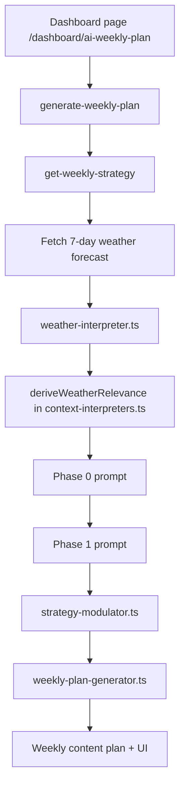

# Weekly Plan Weather Flow

This document traces how weather is handled in the weekly plan flow in the dashboard at `http://localhost:3000/dashboard/ai-weekly-plan`.

## Strategy step: `get-weekly-strategy`

Weather is fetched in [supabase/functions/get-weekly-strategy/weather-fetcher.ts](supabase/functions/get-weekly-strategy/weather-fetcher.ts) from Open-Meteo using latitude and longitude from business location intelligence. If the API fails or coordinates are unavailable, the function falls back to a seasonal Danish weather model.

The raw forecast is converted into a structured strategic interpretation in [supabase/functions/_shared/post-helpers/strategy/weather-interpreter.ts](supabase/functions/_shared/post-helpers/strategy/weather-interpreter.ts). That interpretation includes:

- `indoor_outdoor_bias`
- `strongest_opportunity_day`
- `strongest_constraint_day`
- `weekend_usability`
- `forecast_confidence`
- `operational_note`
- `precipitation_days`
- `week_character`
- `weather_is_newsworthy`
- `baseline_outdoor_viable`

Outdoor seating changes the interpretation directly. When `has_outdoor_seating` is true, the weather scoring rewards warm, low-rain, low-wind days and can push the week toward `lean_outdoor` or `strongly_outdoor`. For businesses without outdoor seating, weather is more likely to be treated as indoor pull, neutral, or low relevance.

The AI prompt does not just get raw weather numbers. It gets a weather interpretation block in Phase 0 and a repeated weather reframing block in Phase 1:

- [supabase/functions/_shared/post-helpers/strategy/phase0.ts](supabase/functions/_shared/post-helpers/strategy/phase0.ts) injects the structured weather section, day-by-day forecast lines, and a hard instruction to reframe rainy-majority weeks as indoor pull rather than terrace/summer content.
- [supabase/functions/_shared/post-helpers/strategy/phase1.ts](supabase/functions/_shared/post-helpers/strategy/phase1.ts) repeats that reframing and explicitly forbids outdoor, terrace, summer, or udeservering language in rainy-majority weeks.

The strategy function stores the full `weekContext` in `weekly_strategies.week_context_snapshot`, so the interpreted weather is persisted with the strategy and later reused by the UI and plan generator.

## Plan generation: `generate-weekly-plan`

The plan generation function fetches a second weather forecast in [supabase/functions/generate-weekly-plan/index.ts](supabase/functions/generate-weekly-plan/index.ts) using the shared OpenWeatherMap helper `getWeatherForecast()` from [supabase/functions/_shared/post-helpers/weather.ts](supabase/functions/_shared/post-helpers/weather.ts).

That forecast is passed into `generateWeeklyPlan()` as `weatherForecast`, and later used to attach weather context to each post idea by matching the post’s `suggested_day` to the forecast day in [supabase/functions/_shared/post-helpers/weekly-plan-generator.ts](supabase/functions/_shared/post-helpers/weekly-plan-generator.ts).

The generated weekly plan also preserves weather-related strategic metadata in each post’s `strategicContext`, including:

- `weather_dependent`
- `weather_flag`
- `peak_day`
- `lead_days_used`
- `booking_nudge_warranted`

## UI output

The dashboard page reads the stored strategy snapshot in [src/app/content/ai-weekly-plan/page.tsx](src/app/content/ai-weekly-plan/page.tsx), extracts `ctx.weather.days`, and exposes it as `weatherDays` on the plan model.

It then derives a simple live summary field called `weatherOpportunity` by counting good vs bad weather days:

- if at least half the days are rain/snow/fog, the opportunity becomes `constrained`
- if at least half the days are sunny/partly cloudy, it becomes `strong`
- otherwise it becomes `neutral`

The visible UI on the weekly plan page shows:

- the weekly weather summary text
- the day-by-day forecast block
- a stale-weather alert and refresh button when the plan looks out of date
- a weather assessment after refresh, including which posts are impacted by weather changes

Those UI states are rendered in [src/components/weekly-plan/WeeklyPlanOverview.tsx](src/components/weekly-plan/WeeklyPlanOverview.tsx).

## End-to-end weather data flow

1. `get-weekly-strategy` fetches Open-Meteo weather for the business location.
2. The raw forecast is converted into a strategic weather interpretation.
3. The strategy prompt uses that interpretation to decide how weather should influence angles.
4. The resulting `weekContext` snapshot is stored with the strategy.
5. `generate-weekly-plan` fetches a second weather forecast from OpenWeatherMap and attaches it to each post.
6. The dashboard reads the stored snapshot, displays `weatherDays`, and exposes refresh/impact states to the user.

## Important distinction

There are two separate weather systems in this flow:

- Strategy weather: Open-Meteo, interpreted into strategic signals for the AI.
- Plan weather: OpenWeatherMap, used to enrich individual post ideas and captions.

The dashboard UI primarily displays the stored strategy snapshot weather and the user-facing refresh assessment, not the entire backend weather interpretation object.

## Weather decision flow

### What decides what

- `get-weekly-strategy` owns the weather interpretation and business-level weather logic.
- `weather-interpreter.ts` decides whether the week is newsworthy, how strong the indoor/outdoor bias is, and which days are strongest or weakest for outdoor use.
- `context-interpreters.ts` decides the practical business outcome, including `terrace_pull`, `indoor_refuge`, and weather relevance for businesses with outdoor seating.
- `phase0.ts` and `phase1.ts` turn those computed signals into prompt context and weather reframing instructions for the AI.
- `strategy-modulator.ts` converts the weather signal into content-strategy adjustments such as `terrace_opportunity` and suppressing outdoor-vibe content when the week is indoor-biased.
- `weekly-plan-generator.ts` carries weather-dependent metadata into the final post ideas so the weekly plan can surface it in the UI.

### Outdoor seating thresholds

The most important active trigger for outdoor seating is:

- `has_outdoor_seating === true`
- average temperature above 16°C
- average rain below 40%
- average wind below 7 m/s

That combination produces `terrace_pull`, which then raises weather relevance and can push the strategy toward outdoor-friendly ideas.

The main fallback signal is the opposite:

- average temperature below 12°C, or
- average rain above 50%

That pushes the week toward `indoor_refuge` and makes indoor messaging the safer strategic choice.

### Practical takeaway

So the AI is not asked to invent weather rules from scratch. The code first computes the weather meaning, then the prompt tells the AI how to use it. The daily forecast is there, but the thresholds and outdoor-seating logic are decided in TypeScript before the model writes the weekly plan.
